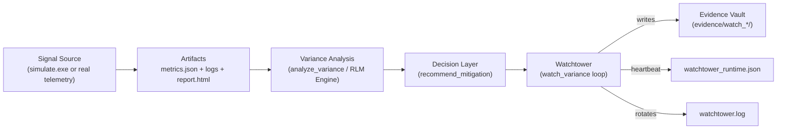
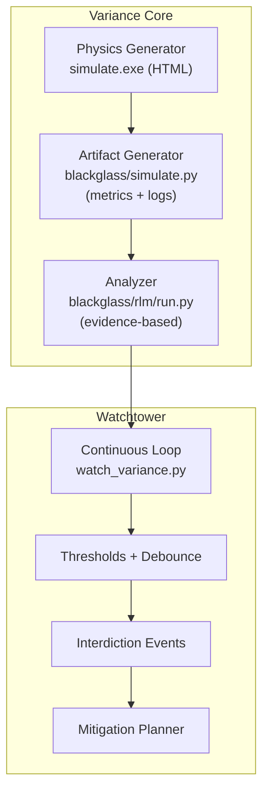

# Blackglass Watchtower — Architecture

Blackglass is a closed-loop reliability system: it generates or ingests signals, detects variance early, produces evidence-backed analysis, and recommends or triggers interdictions.

It is intentionally separated into two layers:

- **Variance Core (Physics + Analysis)**: produces and interprets system signals (drift, saturation, latency, availability).
- **Watchtower (Autonomy + Governance)**: runs continuously, enforces thresholds, writes audit trails, and recommends mitigations.

---

## System Overview

### Closed Loop (end-to-end)



### Separation of Concerns



---

## Components

### 1) Physics (Signal Generation)

Two generators can run in a hybrid mode:

* **Go**: `simulate.exe` produces a human-friendly **HTML report**.
* **Python**: `blackglass/simulate.py` produces machine-friendly artifacts:

  * `metrics.json`
  * `services/*.log` (example: `services/checkout.log`)

Why both:

* HTML is for human proof and stakeholder demos.
* JSON/logs are for deterministic, tool-driven interrogation.

### 2) Intelligence (Evidence Interrogation)

The analysis stage is evidence-first:

* Reads `metrics.json` to detect drift / prediction windows / saturation.
* Greps logs for warning/error signatures.
* Produces structured analysis output (JSON) suitable for downstream automation.

The RLM/engine is treated as **advisory** when rate-limited:

* On 429/quota: the system returns `DEGRADED_ENGINE` and falls back to metrics-only verdicts.

### 3) Watchtower (Always-On Autonomy)

Watchtower is a loop that:

* runs serialized cycles (no overlap)
* enforces singleton execution via `.watchtower.lock`
* self-heals stale locks (> 5 minutes)
* rotates logs at 10MB
* writes `watchtower_runtime.json` heartbeat every cycle
* emits interdiction events and mitigation plans into an evidence folder

---

## Contracts (JSON Schemas)

These contracts are the “neural pathways” between tools. They keep the system machine-parsable, auditable, and composable.

### `metrics.json` (input artifact)

Minimal example:

```json
[
  {
    "timestamp": "13:58",
    "service": "checkout-service",
    "queue_depth": 85,
    "availability": 99.95,
    "latency_ms": 180
  }
]
```

### `analysis.json` (engine output)

Minimal example:

```json
{
  "status": "ok",
  "mode": "engine",
  "objective": "Analyze variance and detect interdiction opportunities",
  "findings": [
    {
      "type": "PREDICTION",
      "signal": "QUEUE_SATURATION",
      "time": "13:58",
      "value": 85,
      "threshold": 50,
      "confidence": 0.9,
      "evidence": ["metrics.json:13:58 queue_depth=85", "checkout.log: WARN WorkerThreadUtilization"]
    }
  ],
  "verdict": "INTERDICT_QUEUE"
}
```

### `mitigation_plan.json` (decision output)

Minimal example:

```json
{
  "status": "ok",
  "trigger": "INTERDICT_QUEUE",
  "recommendations": [
    {
      "action": "SCALE_WORKERS",
      "change": "+20%",
      "rationale": "Queue saturation detected 2 minutes prior to availability drop",
      "evidence": ["metrics.json:13:58 queue_depth=85 (>50)"]
    }
  ]
}
```

### `watchtower_runtime.json` (heartbeat)

Minimal example:

```json
{
  "started_at": "2026-01-18T08:00:00Z",
  "last_cycle_at": "2026-01-18T08:06:00Z",
  "cycle": 1,
  "last_status": "OK",
  "last_run_dir": "evidence/watch_20260118_080600"
}
```

---

## Proof of Life (Curated Demo Artifact)

This repo intentionally ignores noisy runtime exhaust (logs, runs, evidence streams).
Instead, we keep **one** curated artifact set under:

`evidence/demo_run/`

This provides an immediate “clone-and-see” proof without polluting history.

See: `evidence/demo_run/README.md`
