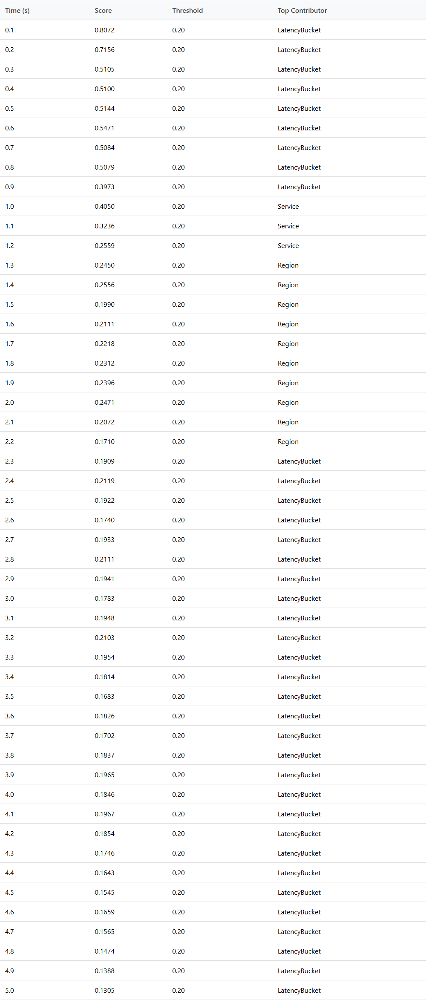
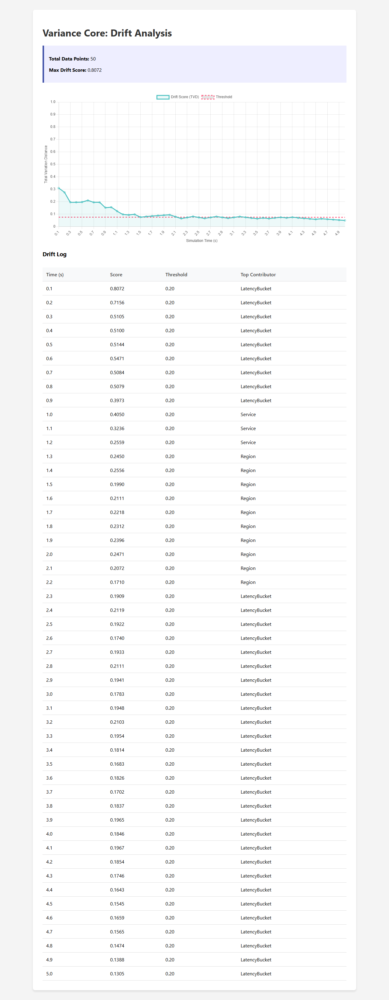

# Visual Proof Generation Walkthrough

## Overview
We enhanced the Variance Core repository by implementing a visible "Drift Log" table in the generated HTML reports and creating an automated Python script to capture visual evidence of the system's functionality.

## Changes
- **Internal Reporting**: Modified `internal/report/html.go` to include a data table detailing drift scores over time.
- **Evidence Capture**: Created `scripts/capture_evidence.py` using Playwright to launch a headless browser, verify chart rendering, and take screenshots.
- **Documentation**: Updated `README.md` to include an automated screenshot of the dashboard.

## Verification Results

### 1. Drift Log Implementation
The generated `report.html` now includes a detailed table of drift events, providing granular visibility into the system's detection logic.
<!-- slide -->

<!-- slide -->

### 2. Automated Evidence Capture
The `capture_evidence.py` script successfully:
- Launched a headless Chromium instance.
- Verified that the `Chart.js` visualization rendered correctly (ensuring JS execution).
- Captured full-page and element-specific screenshots.

### 3. Dashboard Visualization
The following evidence proves the system is generating valid, renderable data visualization:
<!-- slide -->

<!-- slide -->

### 4. Interactive Browser Verification
We performed an automated agentic browser session to verify the final state of both the local report and the remote GitHub repository.
- **Local Report**: Confirmed presence of `driftChart` and "Drift Log".
- **GitHub**: Confirmed successful deployment of the "Thermodynamic Drift Visualization" asset.

## Usage
To regenerate proofs:
1. Build the simulator: `go build -o simulate.exe ./cmd/simulate`
2. Run simulation: `./simulate.exe --drift=true --out=report.html`
3. Capture evidence: `python scripts/capture_evidence.py`
