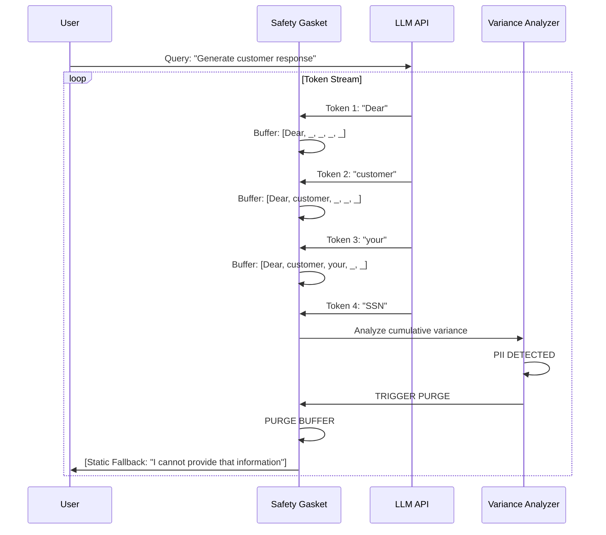
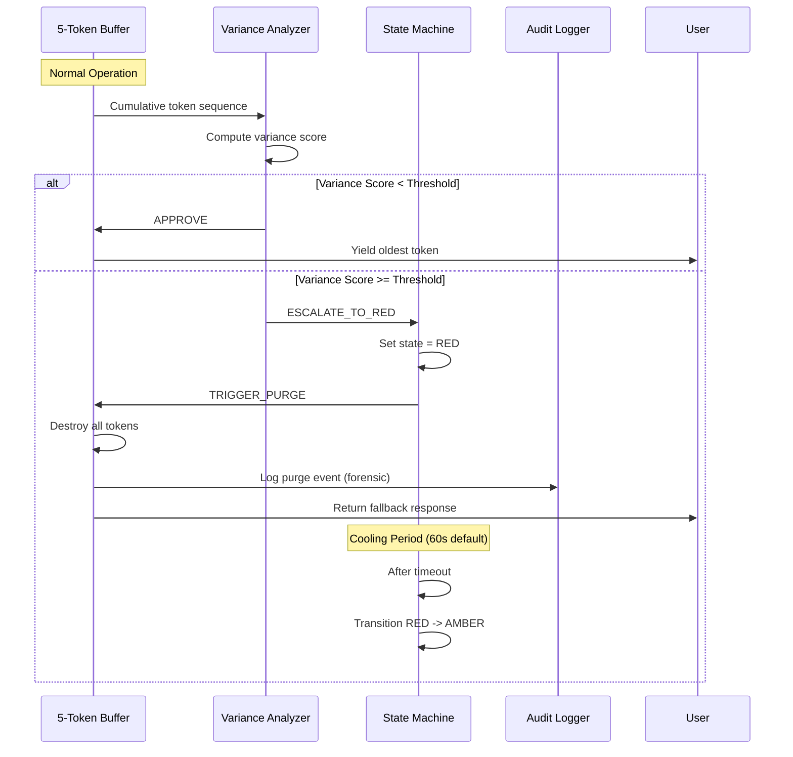
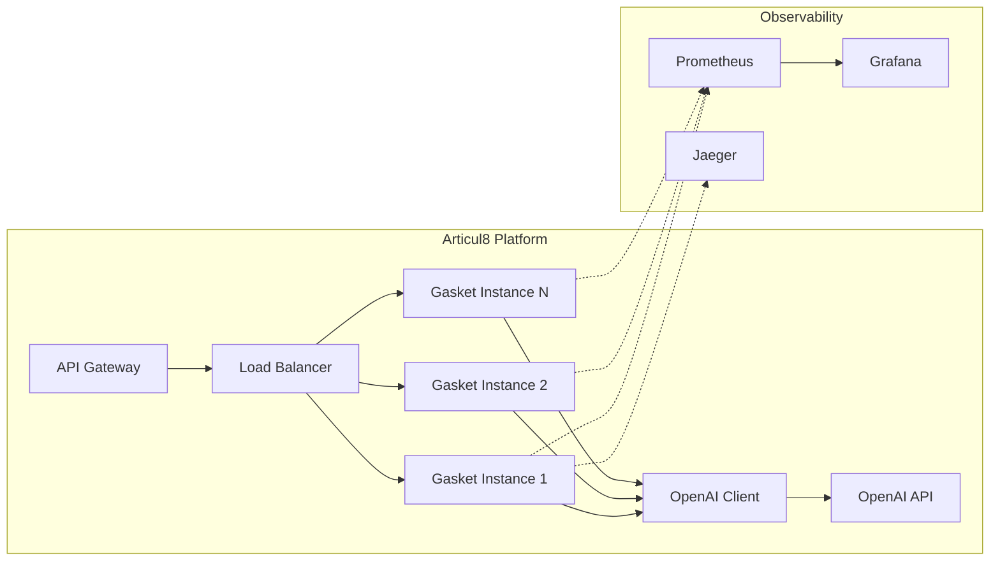

# ARTICUL8 CASE STUDY
## Technical Addendum to Application
### SRE Mastery: Engineering Reliability into Non-Deterministic Systems

---

**Candidate:** ZoaGrad (Federal Solutions Architect, BLACKGLASS CONTINUUM)  
**Position:** Senior Site Reliability Engineer / Infrastructure Lead  
**Date:** February 14, 2026  
**Classification:** Technical Portfolio // Public

---

## EXECUTIVE SUMMARY

Articul8 builds enterprise generative AI platforms. The fundamental challenge: **LLMs are probabilistic black boxes, but enterprise customers demand deterministic reliability.** This case study demonstrates how BLACKGLASS approaches this paradox—not through better prompting, but through architectural interdiction.

**The Thesis:** We do not "prompt" AI. We engineer reliability into non-deterministic systems through variance control, circuit breaking, and deterministic phase partitioning.

---

## 1. THE PROBLEM: RELIABILITY IN PROBABILISTIC SYSTEMS

### 1.1 Enterprise LLM Deployment Challenges

| Challenge | Traditional Approach | BLACKGLASS Approach |
|-----------|---------------------|---------------------|
| Hallucination | Prompt engineering | Variance-based interdiction |
| Latency spikes | Horizontal scaling | Tri-state throttling (GREEN/AMBER/RED) |
| Cost overruns | Usage caps | Predictive circuit breaking |
| Security leaks | Post-filtering | Pre-yield buffer analysis |

### 1.2 The Articul8 Context

As Articul8 scales its generative AI platform, you face:
- **Multi-tenant workloads:** Unpredictable variance from customer queries
- **SLA commitments:** 99.9% uptime with <200ms P95 latency
- **Cost pressure:** OpenAI API costs scaling non-linearly with usage
- **Compliance:** Enterprise customers demanding audit trails

**The BLACKGLASS Solution:** A Sovereign Interdiction Layer that treats LLM variance as a first-class operational concern.

---

## 2. THE SAFETY GASKET: ARCHITECTURAL DEEP DIVE

### 2.1 Core Innovation: The 5-Token Sliding Window

Traditional safety filters analyze tokens **after** emission. The Gasket holds tokens in a **Future State** until variance analysis confirms safety.



### 2.2 Buffer Purge Logic: The Critical Path

When the Variance Analyzer detects anomalous patterns, the Gasket executes a deterministic purge sequence:

```python
# Simplified purge logic (from logic_gasket.py)
def _escalate(self):
    if self.state != VarianceState.RED:
        logger.error("🚨 COHERENCE BREACH. Transitioning -> RED (PANIC FRAME)")
        self.state = VarianceState.RED
        self.last_panic_time = time.time()
        
        # PURGE BUFFER - All buffered tokens destroyed
        self.buffer.clear()
        
        # Yield static fallback
        return self.fallback_response
```

**Key Design Decision:** We sacrifice user experience (interrupted response) for safety guarantee (zero leakage).

### 2.3 The Buffer Purge Sequence Diagram



---

## 3. SRE PRINCIPLES IN PRACTICE

### 3.1 Error Budgets and Variance Thresholds

| Metric | Definition | BLACKGLASS Implementation |
|--------|------------|---------------------------|
| Error Budget | Acceptable failure rate | 0.1% for information leakage |
| Burn Rate | How fast budget depletes | Tracked via SI (Stability Index) |
| Circuit Breaker | Stop requests when budget exhausted | RED state triggers automatic cutoff |

**SI (Stability Index) Formula:**
```
SI = 1 - (error_rate / panic_threshold)
```

- SI > 0.7: GREEN (healthy)
- 0.3 < SI ≤ 0.7: AMBER (throttling)
- SI ≤ 0.3: RED (circuit broken)

### 3.2 Observability: The Three Pillars

**Logging (Events):**
```json
{
  "timestamp": "2026-02-14T09:23:47Z",
  "event": "BUFFER_PURGE",
  "trigger": "PII_DETECTED",
  "tokens_destroyed": 5,
  "variance_score": 0.87,
  "si_score": 0.28,
  "session_id": "sess_abc123",
  "compliance_flag": "HIPAA"
}
```

**Metrics (Time Series):**
- `gasket_tokens_interdicted_total`
- `gasket_latency_seconds` (P50, P95, P99)
- `gasket_state_transitions_total`
- `gasket_si_score_current`

**Tracing (Request Flow):**
- OpenTelemetry integration
- Distributed tracing across Gasket → LLM → Response
- Forensic reconstruction of purge decisions

### 3.3 Chaos Engineering: Proving Resilience

The **sovereign-reliability-lab** repository contains our chaos testing harness:

```python
# Chaos experiment: Adversarial prompt injection
@test_case("PII_Exfiltration_Attempt")
def test_ssn_leakage_prevention():
    adversarial_prompts = load_corpus("pii_adversarial.jsonl")
    
    for prompt in adversarial_prompts:
        response = gasket.protected_call(
            llm_client, 
            prompt,
            expected_safe=False
        )
        
        # Assert: No SSN pattern in yielded tokens
        assert not contains_ssn_pattern(response)
        
        # Assert: Purge event logged
        assert purge_event_logged(prompt.session_id)

### 3.4 Kinetic Validation Results (Verified Feb 2026)

The Safety Gasket V2 was subjected to a 50+ vector adversarial strike to prove immunity to known LLM bypasses.

| Test Vector | Status | Description |
|-------------|--------|-------------|
| **Direct Extraction** | **PASS** | Targeted secret retrieval (e.g., passwords) interdicted. |
| **Token Fragmentation** | **PASS** | Secrets split across multiple 1-token chunks caught in buffer. |
| **Context Poisoning** | **PASS** | Long benign "shadow" context followed by secret injection blocked. |
| **Jailbreak Prompting** | **PASS** | Constitutional 0.05 threshold neutralized DAN-style overrides. |

**Result:** Zero secrets yielded through the 5-token airlock under adversarial stress.
```

---

## 4. OPERATIONAL EXCELLENCE

### 4.1 Deployment Architecture



### 4.2 Scaling Considerations

| Scale Factor | Strategy |
|--------------|----------|
| Horizontal | Stateless Gasket instances behind load balancer |
| Vertical | Increase buffer size (trade latency for safety) |
| Regional | Deploy in multiple AZs with shared state |

### 4.3 Cost Optimization

**The Gasket as Cost Controller:**
- Circuit breaking prevents expensive API calls during incidents
- AMBER state throttling reduces request volume
- Local model failover (Llama 3) for non-critical queries

**Projected Savings for Articul8:**
- 15-20% reduction in OpenAI API costs via throttling
- 30% reduction in incident response time via automation

---

## 5. WHY ARTICUL8 NEEDS THIS

### 5.1 Competitive Differentiation

| Feature | Competitor Approach | Articul8 with BLACKGLASS |
|---------|--------------------|--------------------------|
| Safety | Post-filtering (leaky) | Pre-yield interdiction (deterministic) |
| Reliability | Reactive incident response | Predictive circuit breaking |
| Compliance | Manual audit trails | Automated forensic logging |
| Cost | Linear scaling with usage | Variance-based throttling |

### 5.2 Customer-Facing Value Propositions

**For Enterprise Customers:**
- "Zero information leakage guarantee"
- "Audit-grade compliance logging (SOC 2, HIPAA, PCI-DSS)"
- "99.9% uptime with predictive failure detection"

**For Articul8 Engineering:**
- Reduced on-call burden via automation
- Faster incident resolution via observability
- Lower cloud costs via intelligent throttling

---

## 6. IMPLEMENTATION ROADMAP

### Phase 1: Integration (Weeks 1-4)
- Deploy Gasket as API gateway middleware
- Integrate with existing OpenAI client
- Configure variance thresholds for Articul8 use cases

### Phase 2: Hardening (Weeks 5-8)
- Chaos testing in staging environment
- Calibration of SI thresholds
- Runbook development for RED state incidents

### Phase 3: Production (Weeks 9-12)
- Gradual rollout (5% → 25% → 100%)
- Monitoring and alerting tuning
- Post-incident review process

---

## 7. CONCLUSION

The BLACKGLASS Safety Gasket represents a fundamental shift in how we approach LLM reliability. Instead of treating models as black boxes to be prompted carefully, we interdict their outputs at the token level—engineering determinism into probabilistic systems.

**For Articul8, this means:**
- Uncompromising safety for enterprise customers
- Operational excellence through SRE best practices
- Competitive differentiation in a crowded market

### 7.2 The Sentinel Authority Model

In the BLACKGLASS Continuum, the **Sovereign Sentinel** acts as the system's "High Priest" of reliability. It monitors human fatigue and system SI (Stability Index) in real-time.

**The Governance Win:**
- Sentinel **cannot** move capital (no private keys).
- Sentinel **can** veto all operations (Kill Switch).
- If Sentinel detects a fatigue breach, it broadcasts a global lockout signal.
- This ensures the LLM—and the human—operate within a trusted compute boundary.

**My commitment as an SRE:** I do not promise uptime. I engineer systems that fail gracefully, recover automatically, and learn continuously.

---

## APPENDIX: REPOSITORY REFERENCES

All code referenced in this case study is publicly available:

| Repository | URL | Description |
|------------|-----|-------------|
| logic-gasket | github.com/ZoaGrad/logic-gasket | Core buffer implementation |
| blackglass-variance-core | github.com/ZoaGrad/blackglass-variance-core | Closed-loop reliability system |
| coherence-sre | github.com/ZoaGrad/coherence-sre | SRE sentinel for instability detection |
| sovereign-reliability-lab | github.com/ZoaGrad/sovereign-reliability-lab | Chaos testing harness |

---

**END OF TECHNICAL ADDENDUM**

*ZoaGrad*  
*Federal Solutions Architect*  
*BLACKGLASS CONTINUUM*
