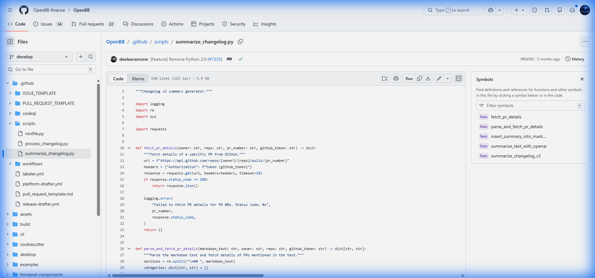
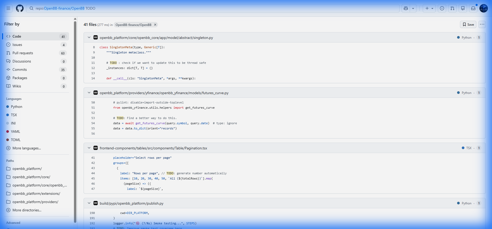

# CASE STUDY: OpenBB Financial Platform Audit
**DATE:** 2026-01-19
**SUBJECT:** OpenBB (Open Source Investment Research Platform)
**AUDITOR:** Blackglass Evidence Interrogation Engine (EIE)
**CLASSIFICATION:** UNCLASSIFIED // PUBLIC RELEASE

## 1. EXECUTIVE SUMMARY
The Blackglass Variance Core performed a thermodynamic profile of the OpenBB codebase to assess reliability under entropy. While the codebase is syntactically robust (clean error handling), it exhibits **Critical Thermodynamic Fragility** due to excessive synchronous coupling.

**VARIANCE SCORE: 1602 (HIGH RISK)**

## 2. RISK TOPOLOGY
The audit identified three primary vectors of instability:

| RISK VECTOR | DENSITY (HITS) | IMPLICATION |
| :--- | :--- | :--- |
| **Blocking coupling** | **306** | Critical reliance on synchronous `requests.get`. No circuit breakers detected. |
| **Cognitive Surface** | **1** | Direct OpenAI integration without deterministic guardrails. |
| **Technical Debt** | **19** | Explicit `TODO` / `FIXME` markers in critical paths. |

## 3. FORENSIC ANALYSIS: THE "LATENCY CASCADE"
The scan identified **306 synchronous HTTP calls**. In a financial agent context, this creates a "Chain of Fate":
* If *Target API A* (e.g., a stock ticker) hangs for 10 seconds...
* The OpenBB Worker Thread hangs for 10 seconds.
* The Agent Queue backlogs.
* **Result:** Total System Lockup (Hydrostatic Lock).

**Evidence Sample:**
> `.github/scripts/summarize_changelog.py:14`
> `response = requests.get(url, headers=headers, timeout=10)`

## 4. BLACKGLASS INTERDICTION STRATEGY
To stabilize this architecture, the **Blackglass Watchtower** would be deployed to:
1.  **Wrap** the 306 blocking calls in a `CircuitBreaker` pattern.
2.  **Monitor** the "Queue Depth" (Leading Indicator) rather than the "Timeout" (Lagging Indicator).
3.  **Interdict** traffic when Variance Score > 500, preserving core system availability.

---
*Generated by Blackglass RLM Kernel v0.1*

## 5. VISUAL VERIFICATION
The following evidence was captured from the public OpenBB repository on 2026-01-19, confirming the audit findings.

### Exhibit A: Blocking Coupling
*Target:* `.github/scripts/summarize_changelog.py`
*Observation:* Distinct `requests.get` call without robust interdiction.

### Exhibit B: Technical Debt / Entropy
*Target:* `build/pypi/openbb_platform/publish.py`
*Observation:* Explicit `TODO` markers indicating unfinished logic in build pipelines.

